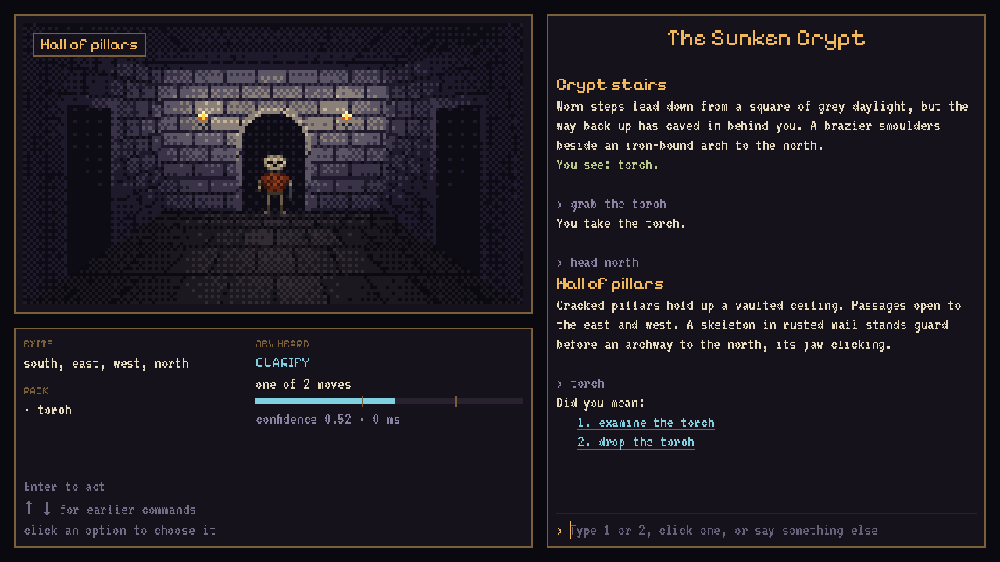

# godot-jev

A Godot 4 add-on for Jev, and *The Sunken Crypt*, a small D&D-style dungeon crawl whose parser
understands whatever the player types but can only choose moves the author made possible.



Classic parser games failed on vocabulary ("I don't know the word 'grab'"). LLM-driven games fail
the other way, inventing doors and items that don't exist. Here the author writes every room, item
and line. Each turn, the moves possible *right now* become the options of one Jev Choice, plus
"none of these". The model can't pick a door that isn't there, because it isn't an option.

```
player types: "grab the torch"
        │
world.possible_actions()  → take__torch, examine__torch, go__north, look__around, ... + none_of_these
        │
Jev Choice ─ confidence ≥ 0.75 → act:      world.apply("take__torch") → "You take the torch."
           ─ ≥ 0.40            → clarify:  "Did you mean: 1. examine the torch  2. drop the torch"
           ─ lower, or none    → unknown:  an authored "that doesn't seem possible" line
```

With more than 254 possible actions (Jev's Choice takes up to 255 options, and one is "none"), it
asks twice: first which verb, then which action with that verb.

## The dungeon

Six rooms, five items, and one chain of puzzles. The player starts at the bottom of a collapsed
stair and has to reach the vault.

```
                     [ Vault ]
                         │   black door: needs the silver key
                  [ Antechamber ]
                         │   guarded: the skeleton won't let you pass
  [ Ossuary ] ── [ Hall of pillars ] ── [ Armory ]
    dark: needs          │                sword, vellum
    a lit torch   [ Crypt stairs ]  ← start
                    torch, brazier
```

One route through it: take the torch and light it in the brazier. Go north to the hall, then east
to the armory for the shortsword (the vellum there hints at the rest). Back in the hall, attack the
skeleton. West, the ossuary is pitch black without a lit torch; with one, the silver key is on the
altar. Return through the hall, go north, unlock the black door, and go north into the vault.
`test_the_whole_dungeon_can_be_solved` plays exactly this route.

The player never has to type those words. "Set the rag on fire", "stab the bones" and "use the
little key on the door" all go through the same Choice, whose options are only what's possible
in that room at that moment.

## The screen

| Area | What it shows |
| --- | --- |
| Room art (top left) | A 160×90 pixel scene for the current room, scaled 4×. It fades between rooms, drops to near-black in a dark room without light, and switches to a room's variant art once the variant's flag is set (the hall after the skeleton falls). The room's name sits on a plaque in the corner. |
| Status panel (bottom left) | Exits and what you're carrying, plus **Jev heard**: the last outcome (act, clarify, unknown, or error when the API is unreachable), the action it chose, a confidence meter with ticks at the clarify (0.40) and act (0.75) thresholds, and the turn's latency. It's there to make the experiment visible while playing. |
| Transcript (right) | Room names as headings, your commands echoed in muted text, item lines highlighted, and new text revealed a few characters at a time. Clarify options are links: click one, or type 1 or 2. |
| Input | Enter submits; ↑ and ↓ recall earlier commands. The input is locked while Jev is deciding. |

The layout is 1280×720 and scales with the window (`canvas_items` stretch). The fonts are
[VT323](https://fonts.google.com/specimen/VT323) for body text and
[Pixelify Sans](https://fonts.google.com/specimen/Pixelify+Sans) for headings, both under the SIL
Open Font License (licence files in `demo/fonts/`).

## Writing a world

Everything the game can say or do comes from `demo/world.json`. The engine (`demo/world.gd`) only
reads it.

**Rooms** are keyed by id.

| Field | Meaning |
| --- | --- |
| `title`, `text` | Shown when the player enters or looks around. The title becomes the transcript heading. |
| `exits` | `direction → {to}`. Add `locked_until: <flag>` and `locked_text` for a door, guard or anything else that blocks the way until a flag is set. The exit is still offered, so "go north" gets the authored refusal instead of "I don't understand". |
| `items` | Item ids lying in the room at the start. |
| `dark`, `dark_text` | The room shows `dark_text` and hides its items until the world's `light_flag` is set. |
| `variants` | `[{when, text, art}]`. The first variant whose `when` flag is set replaces the room's text and art. |

**Items** have a `name` (used in every generated option, like "take the torch"), the `text` shown
on examine, and `takeable`.

**Interactions** are the special moves: `id` (`verb__object`), `text`, `needs` (`holding` item
ids, `in` a room, `flag_unset`), the flag it `sets`, and what it `says`. Take care over `text`: it's
the option description the model reads when it matches the player's words, so it should say what
the move is ("attack the skeleton with the shortsword"), not how it turns out.

Built-in moves are generated for every room: look around, check inventory, go through each exit,
and take, examine or drop each item that is visible or carried.

## Room art

The PNGs in `demo/art/` are placeholders painted by code:

```bash
godot --headless --path . --script res://tools/paint_rooms.gd
```

`tools/paint_rooms.gd` draws each room in one-point perspective (brick walls, a flagstone floor
and a vaulted ceiling), cuts doorways for the room's exits in `world.json` (north is an arch in the
back wall; east and west are openings in the side walls; south is behind the viewer), and adds
props from small ASCII sprites: the skeleton, braziers, sconces, skull niches, chests and the crown.
Lighting is computed per pixel from each room's lights and then snapped to fixed colour ramps with
4×4 Bayer dithering, so the output stays a limited-palette pixel image rather than a smooth
gradient.

To use real art, replace any file with a 160×90 PNG of the same name: the room id, or the
variant's `art` name. `test_every_room_and_variant_has_art` fails if one is missing. Dark rooms
don't need separate art; the scene dims the room's image at runtime.

## What's here

| Path | Role |
| --- | --- |
| `addons/jev/` | The add-on: `Jev` autoload, `http_decider.gd` (HTTPRequest to the REST API), `jev_q.gd` (question builders), `scripted_decider.gd` (tests and offline play) |
| `demo/world.json` | The authored dungeon: 6 rooms, 5 items, 3 interactions |
| `demo/world.gd` | Rules: possible actions, room variants, and authored responses only |
| `demo/parser.gd` | Player text to one possible action, gated by confidence |
| `demo/adventure.gd` | The playable scene: art, status panel, transcript and input |
| `demo/transcript.gd` | BBCode for the transcript; escapes all authored and typed text |
| `demo/art/`, `demo/fonts/` | Room images and the two pixel fonts |
| `tools/paint_rooms.gd` | Regenerates the placeholder room art |
| `tests/` | A headless runner and 25 tests |

Using the add-on in any game:

```gdscript
const JevQ := preload("res://addons/jev/jev_q.gd")

var out := await Jev.decide({"hp": 12, "enemy": "wolf", "weapon": "stick"}, {
	"flee": JevQ.noul("The character should run away."),
	"mood": JevQ.choice("How does the innkeeper feel about the player?", {"warm": "friendly", "wary": "suspicious", "hostile": "angry"}),
})
if out.has("error"):
	pass  # fall back to scripted behaviour
```

## Hypothesis

A Choice over the currently possible moves lets players type naturally with few dead ends, while
the game stays fully authored, and it's fast enough to feel like a parser, not a chat.

## Checks (done when)

1. **Understanding.** On a corpus of ≥ 100 player inputs across the demo (paraphrases, typos,
   indirect requests), ≥ 90% resolve to the intended action or a clarify that contains it, and
   ≥ 90% of impossible or off-topic inputs resolve to `unknown`.
2. **Speed.** p95 ≤ 500 ms per turn from input to response. The status panel shows each turn's
   latency; the corpus eval should record it.
3. **Nothing invented.** The options offered are exactly the possible actions plus `none`, for
   every state of the demo. `[pass]` by construction: `test_options_are_exactly_the_possible_actions_plus_none`.
4. **Shippable.** An exported build works with no key in the client, through a small proxy.

## Run it

```bash
export TYPESAFE_API_KEY=sk-...        # read by the Jev autoload; local prototyping only
godot --path .                        # play
godot --headless --path . --import
godot --headless --path . --script res://tests/run_tests.gd
```

Without a key the game still runs, but every turn reports that the parser is offline.

## Open

1. Write the check-1 corpus (`tests/corpus.json`: input, game state, expected action) and a
   headless eval script that plays it against the live API. The dungeon now has enough rooms,
   items and blocked exits to cover paraphrases, wrong-room requests and "none" cases.
2. D&D mechanics that stay authored: hit points, and d20 checks whose outcomes are all written
   (`"check": {"dc": 12, "pass": "...", "fail": "..."}`), so the parser still only chooses the move
   and code rolls the dice.
3. Creatures that react through `Noul` and `Score` questions about what they see ("the player is
   threatening me", "how afraid is the goblin"), alongside the parser.
4. Scenery the player can examine (the brazier, the altar, the pillars) without making it an item.
5. A tiny key-holding proxy for exported builds (check 4).
6. Package `addons/jev` for the Godot Asset Library.

Don't ship an API key inside an exported game: anyone can extract it. The HTTP decider takes a
`base_url` so a proxy can hold the key instead.
